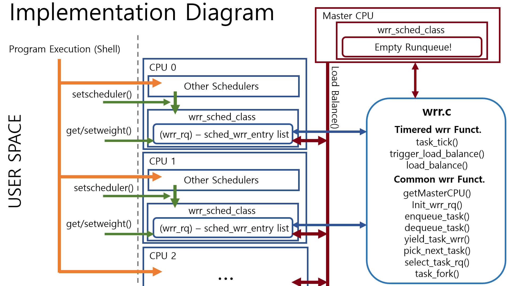

Use git clone to download source.
Create tizen-image directory and unzip&copy the required image files. (As in proj0)
Enter cloned source directory and git switch to proj2 branch.
The directory structure should look like
  
dir_root/   
------osfall2021-team1-proj2/  
------------qemu.sh  
------------generate.sh (Automated kernel building and image movement script)  
------------kernel/  
------------------sched/  
------------------------/wrr.c (wrr implementation)  
------------------------/sched.h (scheduler registeration)  
------------------------/core.c (linked & enabled wrr functionalities in existing kernel. Also systemcall implementations)  
------------include/  
------------------linux/sched.h (defined sched_wrr_entity)  
------------------uapi/linux/sched.h (registered wrr scheduler)  
------------test/  
------------------Makefile (Also mounts & moves binaries into the root image.)  
------------------infloop.c (Infinitely looping program. Used as a background process.)  
------------------infloop_weight.c (Same as above, but intial weight set to 1.)  
------------------prime.c (user level test code (prime factorization) implementation)  
------tizen-image/  
------------.img files  
  
------Building the OS------  
Change "#define __WRR_SCHED_DEBUG 1" to 0 in kernel/sched/sched.h to disable debug messages (Default set to 1.)  
Enter osfall2021-team1-proj2 and run ./generate.sh to build the kernel. (Requires root privileges)
  
------Building Test Files------  
Enter osfall2021-team1-proj1/test and enter "make". (Requires root privileges)

To run the VM, change directory to osfall2021-team1-proj2 and run ./qemu.sh (Requires root privileges)  
After booting run the copied binary in the root user home directory.  
  
Test code usage example  
 1.      ./infloop&                   => make 1 w = 10 background process, with status prints on.  
 2.      ./infloop 1 10&              => make 1 w = 10 background process, with status prints off, and fork 10 more.
 3.      ./infloop 1 10 7&            => make 1 w = 10 background process, with status prints off, set weight to 7, and fork 10 more.  
 4.      ./infloop_weight             => make 1 w = 10 background process, with status prints on.  
 5.      ./prime <num> <weight>       => run prime factorization for 10 values (num, num+1, ... ,num+9)  
 6.      ./syscall <systemcall> <pid> => call system call to certain pid ex) ./syscall 399 1159  
   
High level design  
  
include/linux/sched.h 
  – Defined sched_wrr_entity (wrr runque node)  
Include/uapi/linux/sched.h   
  – WRR register scheduler (SCHED_WRR 7)  
kernel/sched/rt.c & fair.c   
  – Inserted WRR in the priority between RC – CFS .  
kernel/sched/sched.h   
  – Defined WRR macros and wrr_rq struct .  
kernel/sched/core.c   
  – Linked & enabled wrr functionalities in the existing kernel. Also systemcall implementations
kernel/sched/wrr.c   
  – Main implementation of WRR.  
  
investigation

