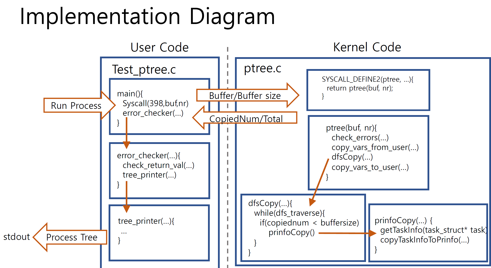

Use git clone to download source and switch to proj1 brach.  
Create tizen-image directory and unzip&copy the required image files. (As in proj0)  
The directory structure should look like  
  
dir_root/  
------osfall2021-team1-proj1/  
------------qemu.sh  
------------generate.sh  (Automated kernel building and image movement script)  
------------kernel/  
------------------ptree.c  (ptree syscall implementation)  
------------test/  
------------------mnt.sh   (Root image mount script)  
------------------test_ptree.c  (user level test code implementation)  
------------------mount  (Mount directory for the root image)  
------tizen-image/  
------------.img files   
  
   
------Building the OS------  
Remove "#define __DEBUG_PTREE 1" from ptree.c before building to remove ptree debug messages. (Default included.)  
Enter osfall2021-team1-proj1 and directory run ./generate.sh  

------Building Test Files------  
Enter osfall2021-team1-proj1/test and create "mount" directory.  
Build with arm-linux-gnueabi-gcc test_ptree.c  
run ./mnt.sh to mount root image and copy the binary to the root directory in the mounted image.  
Unmount root image before running the VM.

To run the VM, change directory to osfall2021-team1-proj1 and run ./qemu.sh  
After booting run the copied binary in the root user home directory.  

It will test 5 cases  
 1.      Normal cases it passes buf and nr returned from syscall  
 2.      nr NULL case => EINVAL  
 3.      buf NULL case => EINVAL  
 4.      nr less than 1 case  
 5.      Invalid access case => EFAULT  
   
   
 High level design  
 
 ------ptree.c------  
 Implements kernel side code.  
 Uses task_struct of the PID 0 process as the head of the process tree.  
 Calls dfsCopy() to traverse the process tree in DFS.  
 dfsCopy() calls prinfoCopy() to copy required information to the buffer, if buffer is not full.  
 If full, only the counter is increased.  
   
 ------test_ptree.c------  
Calls syscall 398 to test ptree system call function.  
Calls error_checker() to check return values. error_checker calls tree_printer() if there are no errors.  
tree_printer() uses stack to traverse and print the processes in depth first order.  
  
  
Investigation & Lessons  

Linux Processes are created from a single root process with PID 0.  
Each processes are child of a single parent process, and the processes form a tree structure.   

The root process is "swapper", and all processes are either fork()ed or exec() from swapper.  
Swapper itself is started on boot, by LILO(linux loader) GRUB(GRand Unified Bootloader) or other bootloaders.  

Swapper was originally used to swap processes in/out of disks, to save memory. 
The swapping function is now processed by other kernel processes, such as kswapd. 
Swapper is now used as a "idle task", a task(job) with the lowest priority and is ran when all other processes are idle.  

Systemd (system daemon) and kthreadd (Kernel thread daemon) hold PID 1 and 2. 
Systemd manages system and service daemons, and kthreadd controls kernel threads. 
Kernel threads are threads used by the kernel to do background tasks, such as managing hardware.  
  
  
Lessons Learnt

1.How to use Git for cooperative development and version control.  

2.Basic structure of the Linux source code, and where to find/modify to add custom kernel functions.  

3.How to call system calls directly in user code, using system call IDs and functions.  

4.Experience of basic kernel programming, including various APIs and possible errors that were unavailable at the user level.  

5.Knowledge of Linux process tree structure, and the top-level processes, such as swapper, systemd, kthreadd.  

